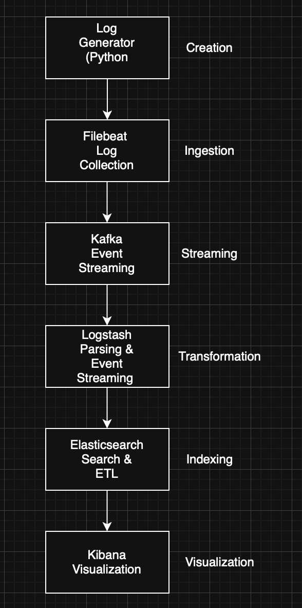
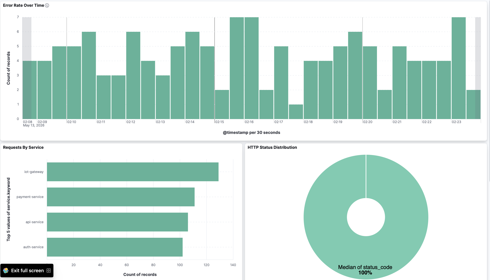
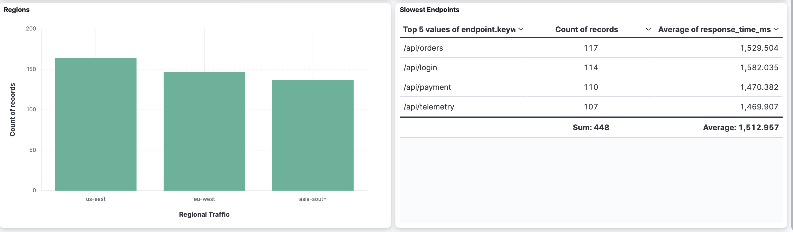
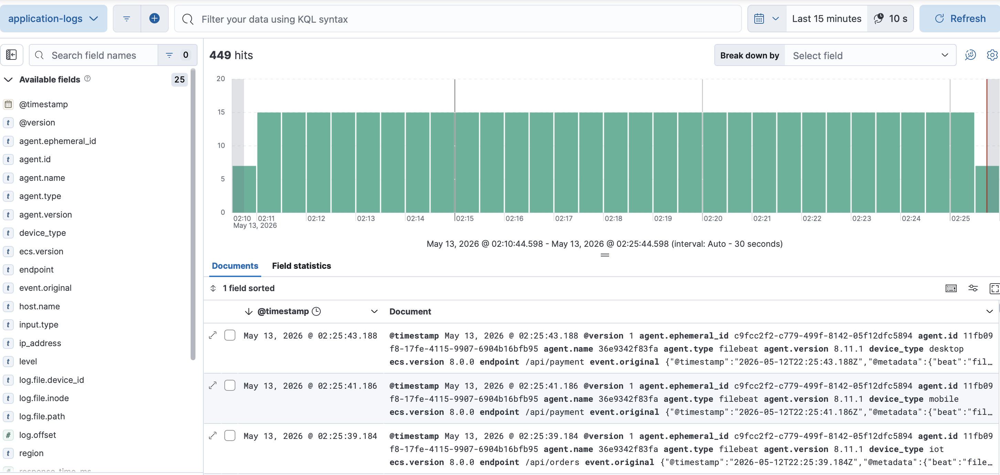
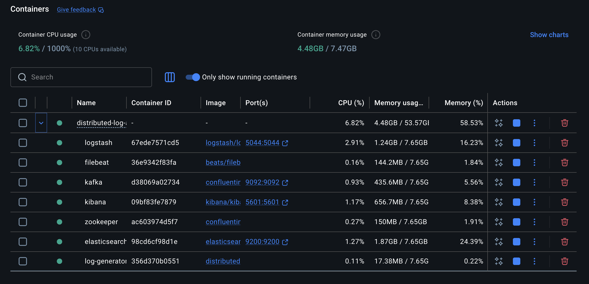

# Distributed Log Analytics Platform

## Overview

This project is a distributed observability and log analytics platform built using Kafka, Filebeat, Logstash, Elasticsearch, Kibana, and Docker.

The platform simulates a production-style centralized logging pipeline capable of ingesting, streaming, processing, indexing, and visualizing structured application logs in real time.

This repository was created as a hands-on learning and engineering portfolio project focused on:
- distributed systems
- observability engineering
- event streaming
- container orchestration
- centralized logging pipelines

---

## Architecture



---

## Technologies Used

Before building the platform, I researched the role of each technology and how they interact within a distributed logging pipeline.

### Log Generator Service

The log generator simulates production-style backend services and continuously emits structured JSON logs.

The service is responsible for:
- simulating API traffic
- generating INFO/WARNING/ERROR events
- producing realistic telemetry data
- feeding the observability pipeline

Example log:

```json
{
  "timestamp": "2026-05-12T10:15:00",
  "service": "auth-service",
  "level": "ERROR",
  "message": "Database connection timeout",
  "user_id": 1024
}
```

### Filebeat

Filebeat acts as a lightweight log shipper.

Responsibilities:
- monitoring log files
- harvesting new log events
- forwarding logs into Kafka

### Kafka

Kafka acts as the distributed event streaming layer of the platform.

Responsibilities:
- buffering log events
- decoupling ingestion from processing
- enabling scalable event streaming
- preventing pipeline overload

### Logstash

Logstash processes and transforms incoming events.

Responsibilities:
- consuming Kafka messages
- parsing structured JSON logs
- transforming and enriching events
- forwarding processed logs to Elasticsearch

### Elasticsearch

Elasticsearch is responsible for:
- indexing structured logs
- enabling fast search and filtering
- powering analytics queries
- storing observability data

### Kibana

Kibana provides:
- dashboards
- visualizations
- live log exploration
- observability analytics

### Apache ZooKeeper

ZooKeeper is a distributed coordination service used by Kafka.

Responsibilities include:
- broker coordination
- leader election
- cluster metadata management
- distributed synchronization

---

## System Flow

```text
Log Generator
      ↓
Filebeat
      ↓
Kafka
      ↓
Logstash
      ↓
Elasticsearch
      ↓
Kibana
```

---

## Implementation Process

### Infrastructure Setup

The platform infrastructure was orchestrated using Docker Compose.

Initial setup included:
- Docker networking
- persistent storage volumes
- service dependency management
- multi-container orchestration

Started by configuring:

- [docker-compose.yml](./docker-compose.yml)

Note:

Service startup order matters due to infrastructure dependencies.

For example, Kafka depends on ZooKeeper for broker coordination and metadata management.

Docker Compose `depends_on` was used to coordinate service startup order.

---

### Log Generator Service

Created:
- [Dockerfile](./services/log-generator/Dockerfile)
- [app.py](./services/log-generator/app.py) (comment the whole second part block)

The generator continuously produces structured JSON logs to simulate realistic backend application traffic.

Build and start the infrastructure:

```bash
docker compose up --build
```

---

### Filebeat & Kafka Integration

Kafka topics were created for distributed event streaming.

```bash
docker exec -it kafka bash

kafka-topics \
--create \
--topic application-logs \
--bootstrap-server localhost:9092

kafka-topics \
--list \
--bootstrap-server localhost:9092

exit
```

Configured:
- [filebeat.yml](./filebeat/filebeat.yml)

Filebeat continuously monitors application logs and ships events into Kafka.

Restart Filebeat after configuration changes:

```bash
docker compose restart filebeat
```

Verify Kafka event ingestion:

```bash
docker exec -it kafka bash

kafka-console-consumer \
--topic application-logs \
--bootstrap-server localhost:9092 \
--from-beginning
```

---

### Logstash Pipeline

Configured:
- [pipeline.conf](./logstash/pipeline/pipeline.conf)

The Logstash pipeline:
- consumes Kafka events
- parses JSON logs
- enriches structured data
- forwards processed events into Elasticsearch

Restart Logstash:

```bash
docker compose restart logstash

docker logs -f logstash
```

Verify Elasticsearch availability:

```text
http://localhost:9200
```

Verify Elasticsearch indices:

```text
http://localhost:9200/_cat/indices?v
```

---

### Kibana Setup

Kibana becomes available through:

```text
http://localhost:5601
```

Data views were configured using:

```text
Stack Management → Data Views
```

Created data view:
- `application-logs`
- index pattern: `application-logs*`

---

## Structured Log Enrichment

To make the observability dashboards more realistic, additional telemetry fields were added to generated logs.

Additional fields include:
- response times
- HTTP status codes
- regions
- endpoints
- device types

Updated:
- [app.py](./services/log-generator/app.py)

After modifying Python code: (uncomment the second part)

```bash
docker compose up --build -d
```

A rebuild is required so Docker can rebuild the Python container image.

---

## Kibana Dashboards

Several Kibana dashboards and visualizations were created to simulate real-world observability analytics.

Created visualizations include:
- Error Rate Over Time
- Requests By Service
- HTTP Status Distribution
- Slowest Endpoints
- Regional Traffic Analysis

Visualization workflow:

```text
Analytics
→ Visualize Library
→ Create Visualization
→ Lens
```

---

## Screenshots

### System Architecture


---

### Dashboard Overview



---

### Error Analysis



---

### Live Log Stream



---

### Running Containers



---

## Useful Commands

Start stack:

```bash
docker compose up -d
```

Stop stack:

```bash
docker compose down
```

Stop stack and remove volumes (WARNING: deletes Elasticsearch data):

```bash
docker compose down -v
```

Rebuild containers after code or configuration changes:

```bash
docker compose up --build -d
```

View infrastructure logs:

```bash
docker compose logs -f
```

Or specific service logs:

```bash
docker logs -f logstash
```

---

## Engineering Concepts Demonstrated

This project demonstrates practical experience with:
- distributed systems
- event-driven architecture
- observability engineering
- centralized logging
- stream processing
- Docker orchestration
- infrastructure design
- real-time analytics pipelines

---

## Future Improvements

Potential future upgrades for the platform:
- Kubernetes deployment
- Kafka clustering
- CI/CD integration
- Infrastructure as Code (Terraform)
- OpenTelemetry integration
- Metrics collection with Prometheus
- Alerting pipelines
- Authentication & security hardening